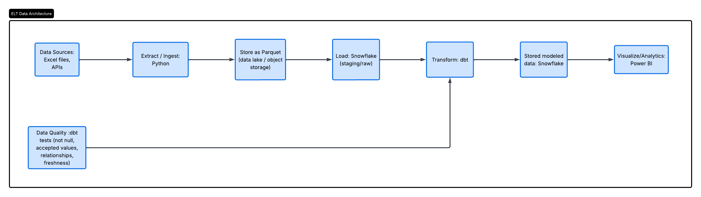
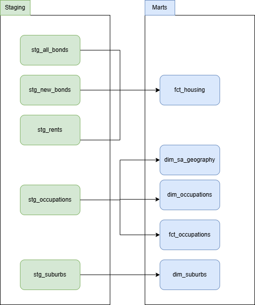
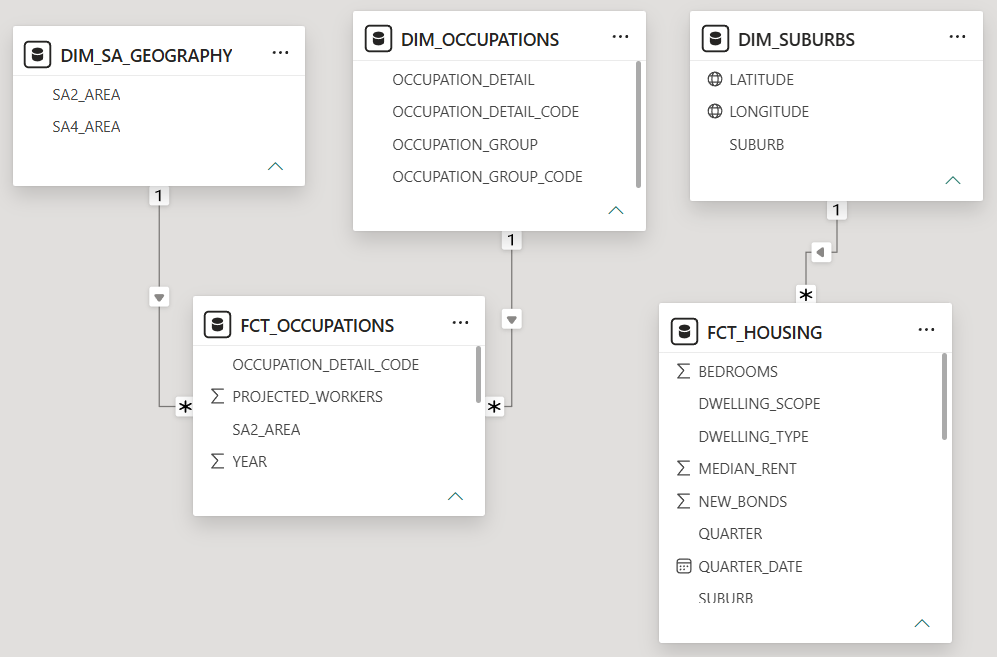
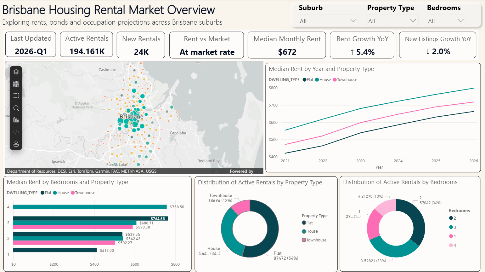
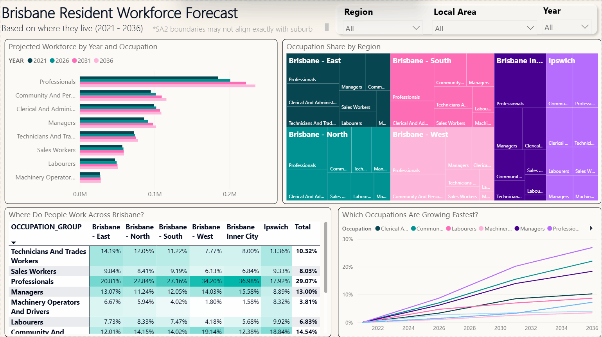

# Brisbane Rentals Data Analytics Pipeline

## Overview
Cloud native end-to-end data pipeline and data modeling using Snowflake &amp; dbt for Brisbane, Australia rental trend.

It aims to help renters understand rental situation (Q1, 2026) in the area they consider to rent, what kind of careers their neighbours work, demand of renters, growth of the market, and also comparing rents based on property types and bedrooms in each suburb.

## Business Requirements 
The purpose of this data pipeline is to answer following questions:
 - How does median rent in a selected suburb compare to the market average?
 - How have rents changed over time ?
 - Which property types dominate the rental market in a selected suburb?
 - How is the rental demand in each area? 
 - What do residents mostly work in selected areas?

## Data Architecture 

Data Flow:
1. **Ingestion** — Python scripts extract raw Excel files and APIs from open data sources and then convert to parquet files 
2. **Storage** — Raw data is loaded into Snowflake raw schema
3. **Transformation** — dbt transforms data through 2 layers:
   staging → marts (dims and facts)
4. **Visualisation** — Interactive dashboard for rental market 
   and workforce insights with Power BI

## Data Sources 
 - Bonds, median weekly rent by suburbs
https://www.rta.qld.gov.au/sites/default/files/2023-04/rta-bond-statistics.xlsx

- Brisbane suburb boundaries and occupation employment by resident employment
https://data.brisbane.qld.gov.au/pages/home/

## Tech Stack
- Python: Ingestion, raw data, parquet files
- Snowflake: Data Warehouse
- dbt: Transformation
- Power BI: Dashboard

## Data Model

### Housing
- **fct_housing** — median rent, total bonds and new bonds 
  by suburb, dwelling type, bedrooms, quarter and flages scope of dwelling type (Detailed, All) for the calculation purpose. 
- **dim_suburbs** — suburb reference data with coordinates

### Occupation
- **fct_occupations** — projected workers by SA2 area, 
  occupation group code and year (2021-2036)
- **dim_occupations** — occupation group and detailed 
  classification
- **dim_sa_geography** — SA2 and SA4 geographic boundaries

## DashBoard

## Issues & Limitations
- The dashboard presents the current rental market for and individual suburb or selected suburbs, without comparision between each area.
- Brisbane suburbs cannot fully connect to SA2 statistical area as I first assumed. So, I separated dim_suburbs and dim_geography
- Not all 195 suburbs are included because rental data source does not cover all suburb, some suburbs have no residential properties, not enough data (e.g. Brisbane Airport, Port of Brisbane) or very few data.

## Future Improvememts 
- Comparing between selected suburbs (ex. Chermside VS New Farm) to make better decisions 
- Big picture in SA4 boundaries such as overall rental in Brisbane - North area
- Rental yield for better investment decision
- Ranking top 10 most afforable/expensive suburbs

## Prerequisites
 - Snowflake account
 - dbt   
 - Python 3.13.12
 - uv package manager
 - Power BI 

